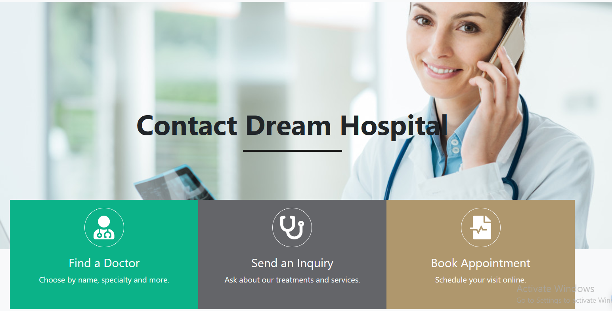

## DREAM-HOSPITAL 🏥

Dream-Hospital By Using this Site patient will get better treatment with specialized health science & auxiliary healthcare staff and medical equipment 🚑🩺


##### Navbar


   
##### Find Option


##### Get-Appionment


##### Specialty


##### Dailysis Unit


##### ICU


##### Indoor & Outdoor


##### Dental Unit


##### Vaccination 


##### Skin Care


##### Pharmacy


##### Ambulance


##### Consultation Unit


##### Female Unit


##### HBO Unit


##### Specialist Doctors List


##### Specialist Doctors List 2nd Page


##### User Information


##### Footer


##### Mission & Vision


##### Contact



##### Inquiry


##### Organ & Static Search


##### Appionment Confirmed


##### Login For Client & Doctor


##### Login Form


## Technologies uses
 - ReactJS basics like setting up project, navigating between pages and data fetching
 - ReactJS advanced topics like dynamic routing, image optimization,  SSG and SSR
 - MaterialUI framework to build responsive website using custom theme, animation and carousel
 - ReactJS including decomposing components, context API and hooks
 - React Connect package to build backend API
 - Firebase to save and retrieve data like Booking apoinment for users
 - Deploy web applications on servers like Web App.


## Run it Locally
```
$ git clone https://github.com/MahamudM90/DREAM-HOSPITAL 
$ cd DREAM-HOSPITAL 
$ npm install
$ npm start
$ Open http://localhost:3000
```
   ###    [Live Site](https://boighorss.vercel.app/?fbclid=IwAR3f1UHUDWg0-41u_pPRq8vSZSZVpnMLtsQ1u3CvYKDppGGCBV4HO2ea-dk)
